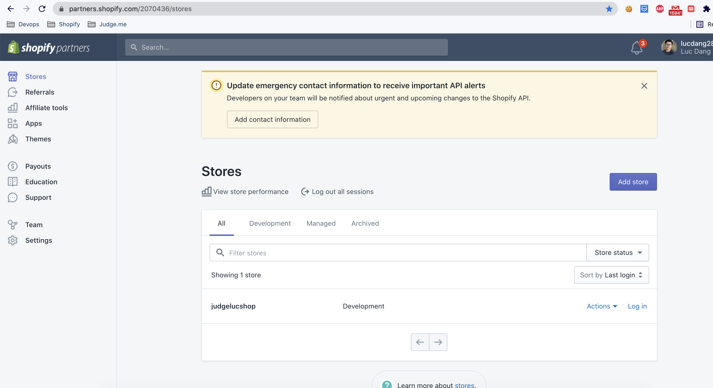
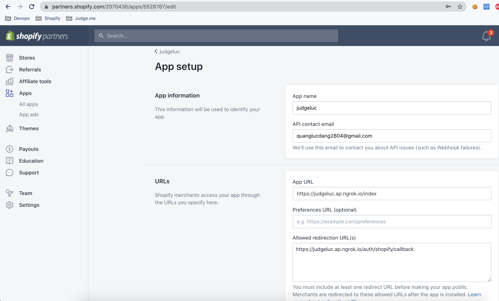
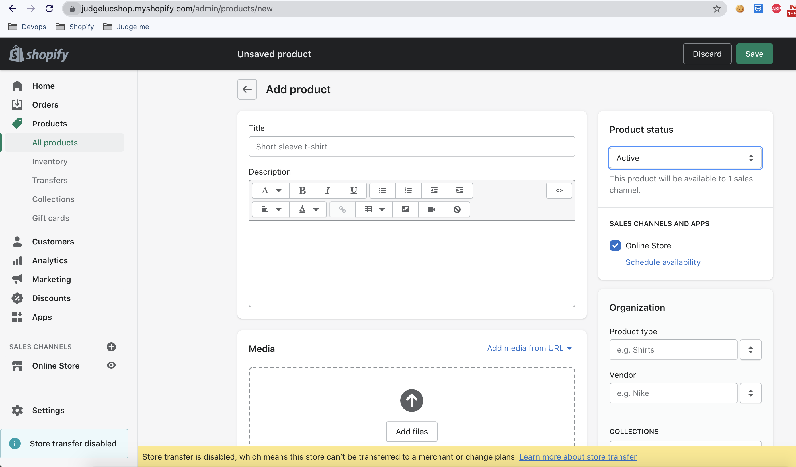
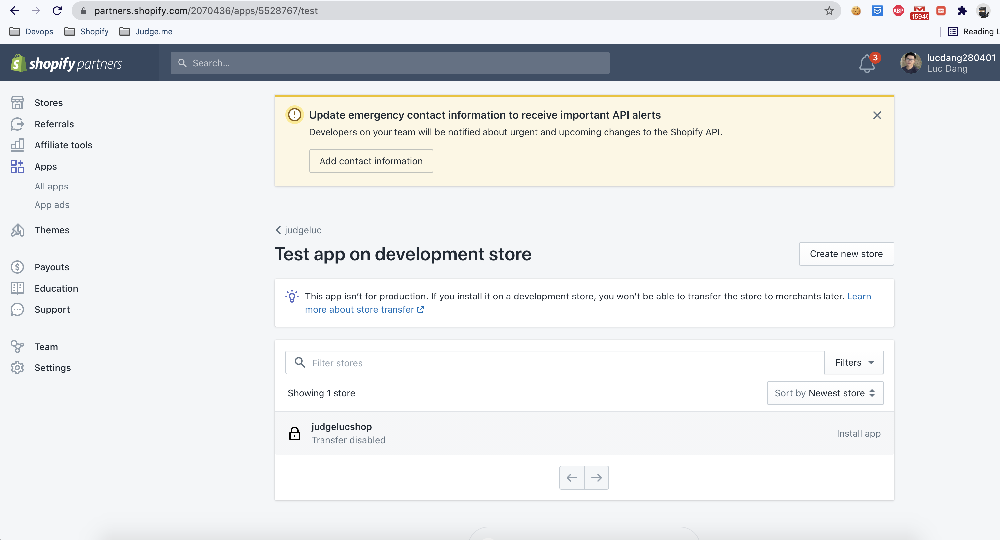

1) Instal pg 0.18.1 , puma 4.3.3 old versions

```bash
gem install pg -v '0.18.1' -- --with-cflags="-Wno-error=implicit-function-declaration"
gem install puma -v '4.3.3' -- --with-cflags="-Wno-error=implicit-function-declaration"
```

2) install mailcatcher

```bash
gem install mailcatcher -- --with-cflags="-Wno-error=implicit-function-declaration"

# run mailcatcher 
mailcatcher
```

3) Start ngrok `~/.ngrok2/ngrok.yml`
    + install ngrok
    + edit ~/.ngrok2/ngrok.yml
    + point ngrok port 80 -> rails server port 3000
    + authtoken find in ngrok profile

```yaml
authtoken: authtoken_example_4cioZiEArvJYrb_Z7XSTofZHXjP3Sf1qcY5
inspect_db_size: 200000000
region: ap
tunnels:
  judgeluc:
    proto: http
    hostname: judgeluc.ap.ngrok.io
    addr: 127.0.0.1:3000
  judgeshopify:
    proto: http
    hostname: judgeshopifyluc.ap.ngrok.io
    addr: 127.0.0.1:3000
```

4) Regis a `shop-partner` on shopify eg: ```https://judgelucshop.myshopify.com/admin/apps```

5) Create an `shop-test` on shopify
   

6) Create an `app-test`
    + APP URL: should include index `https://judgeluc.ap.ngrok.io/index` (ngrok_https_url + /index)
    + Allowed redirection URL(s): https://judgeluc.ap.ngrok.io/auth/shopify/callback (ngrok_https_url + /auth/shopify/callback)

   
7) Create product on `shop-test`



8) Install `app-test` on `shop-test`



