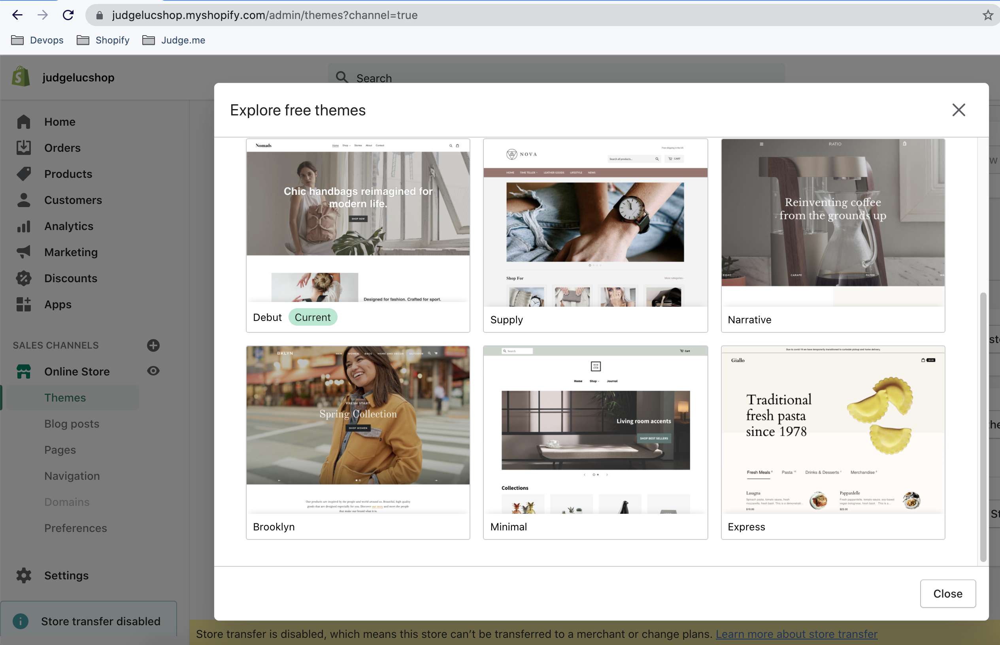
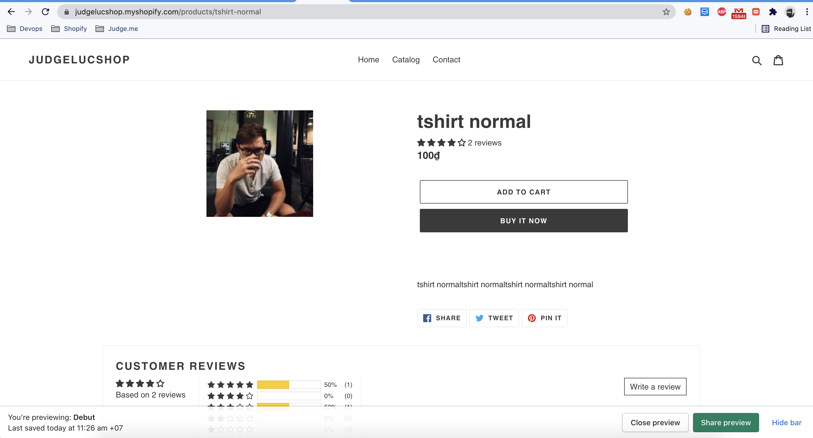
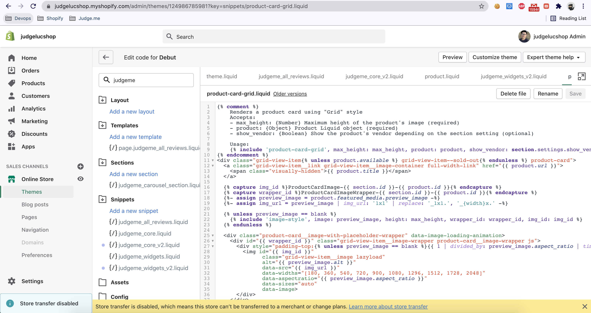

1) Instal pg 0.18.1 , puma 4.3.3 old versions

```bash
gem install pg -v '0.18.1' -- --with-cflags="-Wno-error=implicit-function-declaration"
gem install puma -v '4.3.3' -- --with-cflags="-Wno-error=implicit-function-declaration"
```

2) install mailcatcher

```bash
gem install mailcatcher -- --with-cflags="-Wno-error=implicit-function-declaration"

# run mailcatcher 
mailcatcher
```

3) Start ngrok `~/.ngrok2/ngrok.yml`
    + install ngrok
    + edit ~/.ngrok2/ngrok.yml
    + point ngrok port 80 -> rails server port 3000
    + authtoken find in ngrok profile

```yaml
authtoken: authtoken_example_4cioZiEArvJYrb_Z7XSTofZHXjP3Sf1qcY5
inspect_db_size: 200000000
region: ap
tunnels:
  judgeluc:
    proto: http
    hostname: judgeluc.ap.ngrok.io
    addr: 127.0.0.1:3000
  judgeshopify:
    proto: http
    hostname: judgeshopifyluc.ap.ngrok.io
    addr: 127.0.0.1:3000
```

- SET UP local side

```bash
rake db:create
rake db:migrate
rake db:seed
ngrok start judgeluc
rails s
mailcatcher
sidekiq
brew services start mongodb-community@4.2; brew services start postgresql; brew services start redis; ~/elasticsearch-6.0.0/bin/elasticsearch
```


4) Regis a `shop-partner` on shopify eg: ```https://judgelucshop.myshopify.com/admin/apps```

5) Create an `shop-test` on shopify
   

6) Create an `app-test`
    + APP URL: should include index `https://judgeluc.ap.ngrok.io/index` (ngrok_https_url + /index)
    + Allowed redirection URL(s): https://judgeluc.ap.ngrok.io/auth/shopify/callback (ngrok_https_url + /auth/shopify/callback)

   
7) Create product on `shop-test`


8) Install `app-test` on `shop-test`


9) Install theme debut then PUBLIC



10) Access to product page of shop-test



11) If review badge are not displayed,  shopify blocked your `judgeme_core.liquid` and `judgeme_widgets.liquid` files.

+ View Page Source or Inspect element
+ Find string `<!-- "snippets/judgeme_core.liquid" was not rendered, the associated app was uninstalled -->`
+ If exist `the associated app was uninstalled`
+ That's mean shopify blocked your `judgeme_core.liquid` and `judgeme_widgets.liquid` files.

12) To fix issue  shopify blocked your `judgeme_core.liquid` and `judgeme_widgets.liquid` files.

+ Edit code of current theme (Debut)



+ Clone 2 files which blocked by shopify
+ `judgeme_core.liquid` -> `judgeme_core_v2.liquid`
+ `judgeme_widgets.liquid` -> `judgeme_widgets_v2.liquid`

+ Edit file names to `judgeme_core_v2.liquid` `judgeme_widgets_v2.liquid` in files below:
+ `theme.liquid`
+ `product-card-grid.liquid`
+ `product-card-grid.liquid`
+ `product-template.liquid`

+ Save then refresh page in 3 minutes
